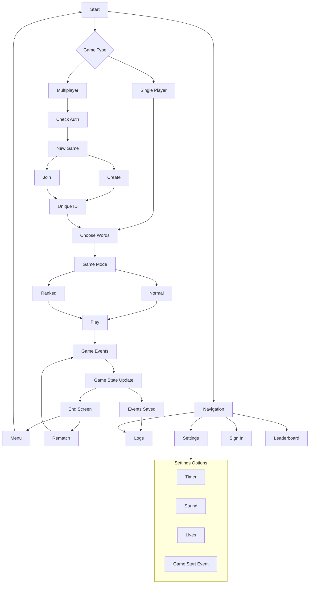

```mermaid
flowchart TD
    START["Start"]

    %% Mode selection
    START --> MODE{"Game Type"}
    MODE --> SP["Single Player"]
    MODE --> MP["Multiplayer"]
    START --> NAV["Navigation"]

    %% Gameplay flow
    SP ------> WORDS["Choose Words"]

    WORDS --> GM["Game Mode"]
    GM --> NORMAL["Normal"]
    GM --> RANKED["Ranked"]

    NORMAL --> PLAY["Play"]
    RANKED --> PLAY

    %% Event layer (shared)
    PLAY --> EVENTS["Game Events"]
    EVENTS --> STATE["Game State Update"]

    %% Mode-specific event sources
    MP --> AUTH["Check Auth"]
    AUTH --> NEW["New Game"]
    NEW --> CREATE["Create"]
    NEW --> JOIN["Join"]
    CREATE & JOIN --> ID["Unique ID"]
    ID --> WORDS

    %% After the game
    STATE --> END["End Screen"]
    END --> MENU["Menu"] & RE["Rematch"]
    RE --> EVENTS
    MENU --> START
    STATE --> LOG["Events Saved"]
    LOG --> LOGS["Logs"]

    %% Navigation
    NAV --> LOGS
    NAV --> SETTINGS["Settings"]
    NAV --> SIGNIN["Sign In"]
    NAV --> LEADER["Leaderboard"]

    SETTINGS["Settings"]
    subgraph SETTINGS_MODEL["Settings Options"]
        TMR["Timer"]
        SND["Sound"]
        LIVES["Lives"]
        GSE["Game Start Event"]
    end

    SETTINGS --> SETTINGS_MODEL
```
